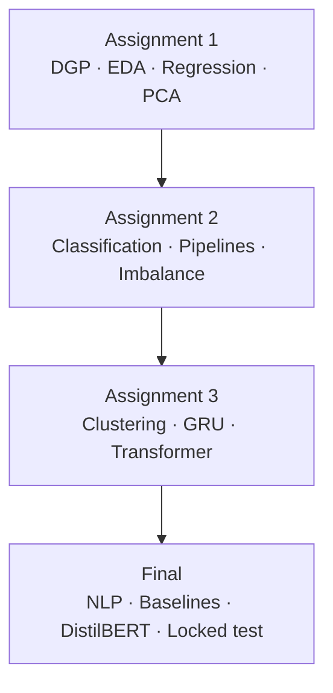

# Data Science — Course Repository

A consolidated workspace for a **data science program** (Yeshiva): three graded assignments, a **team final project**, shared dependencies, and course reference notes. Each major project has its own **README** with problem statement, methodology, results, and reproduction steps.

---

## Repository map

| Path | Topic | Task type | Quick result |
|------|--------|-----------|--------------|
| [`assignments/assignment1/`](assignments/assignment1/) | [California Housing](assignments/assignment1/README.md) | Regression (DGP + EDA + modeling) | Engineered linear model: val **R² ≈ 0.66**, RMSE **≈ 0.67** |
| [`assignments/assignment2/`](assignments/assignment2/) | [Pima Diabetes](assignments/assignment2/README.md) | Binary classification | Balanced logistic: test **ROC-AUC ≈ 0.85** |
| [`assignments/assignment3/`](assignments/assignment3/) | [Online Retail](assignments/assignment3/README.md) | Clustering + sequence models | Transformer **macro-F1 ≈ 0.29** on latent segments |
| [`final/`](final/) | [Amazon review sentiment](final/README.md) | NLP classification (Team 4) | **TF–IDF + SGD**: locked test **F1 ≈ 0.91**, **AUC ≈ 0.97** |

---

## Curriculum arc

The work follows a deliberate progression from **tabular foundations** to **sequences and language**:



**Recurring themes across projects:**

- **Data generating process (DGP)** — State assumptions, omitted variables, and what claims are safe.
- **Exploratory data analysis (EDA)** — Distributions, skew, outliers, and class or spatial structure before modeling.
- **Leakage-safe evaluation** — Fit preprocessors on train folds only; hold out test data until the final step where applicable.
- **Bias–variance and model choice** — Compare simple vs complex models with cross-validation, not a single lucky split.
- **Representation learning** — Engineered features, PCA, embeddings, and Transformers where each is appropriate.

---

## Projects (detail)

### Assignment 1 — California Housing

**Author:** Peter Mangoro · [`assignments/assignment1/README.md`](assignments/assignment1/README.md)

Regression on 1990 census block groups: DGP narrative, EDA, leakage-safe feature engineering (log income, capped ratios, geo terms), then raw vs engineered linear models, polynomial baselines, and PCA. **Best model:** engineered OLS / Ridge.

**Run:** `assignments/assignment1/gdp_california_housing.ipynb` (data via scikit-learn, no download).

---

### Assignment 2 — Pima Indians Diabetes

**Author:** Peter Mangoro · [`assignments/assignment2/README.md`](assignments/assignment2/README.md)

Binary classification with clinical zeros treated as missing, stratified splits, and sklearn `Pipeline`s. Compares **logistic regression** vs **random forest**, then PCA/K-means for exploration. **Winner:** balanced logistic regression on raw features.

**Run:** `assignments/assignment2/pima_diabetes_assignment2.ipynb` + [`diabetes.csv`](assignments/assignment2/diabetes.csv).

---

### Assignment 3 — Online Retail (representation & sequences)

**Author:** Peter Mangoro · [`assignments/assignment3/README.md`](assignments/assignment3/README.md)

Customer-level **K-means** on raw, sequence, and latent (PCA) features; supervised labels from **latent k = 6**. **GRU** vs **Transformer** predict segment from purchase sequences with train-only vocabulary and max length 120.

**Run:** [`assignment3_pipeline.ipynb`](assignments/assignment3/assignment3_pipeline.ipynb) or `python assignments/assignment3/assignment3.py` (optional `--html-report`).

---

### Final project — Amazon review sentiment (Team 4)

[`final/README.md`](final/README.md)

**Team:** Innocent Mujokoro, Tapiwanashe Mutarimanja, Satya Sai Priya Devireddy, Masheia Dzimba, Peter Mangoro

Large-scale **binary sentiment** on Amazon reviews (fastText format): classical TF–IDF baselines, unsupervised clustering (TF–IDF→SVD and sentence embeddings), **MLP** and **DistilBERT**, plus a strict **leakage audit** and **one-time locked test** on `test.ft.txt`.

**Recommendation:** deploy **TF–IDF + linear SVM (SGD)** for best F1, stability, and cost at scale.

**Run:** [`final/final_notebook.ipynb`](final/final_notebook.ipynb) — download [Kaggle Amazon Reviews](https://www.kaggle.com/datasets/bittlingmayer/amazonreviews) into `final/data/` (`train.ft.txt`, `test.ft.txt`). See final README for run order (do not open test until Section 7.3).

---

## Directory structure

```
dataScience/
├── README.md                          # This file
├── assignments/
│   ├── requirements.txt               # Shared Python dependencies
│   ├── assignment1/                   # California Housing
│   ├── assignment2/                   # Pima Diabetes
│   └── assignment3/                   # Online Retail
├── final/                             # Team final: Amazon sentiment
│   ├── final_notebook.ipynb
│   ├── final_notebook.pdf
│   └── Amazon_Sentiment_ArchitectureFinal.pdf
├── DGP_EDA_Beginner_Guide.md          # Course reference (DGP & EDA)
├── W*_*.md / *.pdf                    # Weekly lecture notes & guides
└── *.pdf                              # Topic PDFs (Transformers, Amazon blueprint, etc.)
```

Large or local-only paths (not in git): `final/data/`, `final/.venv/`, `final/archive.zip` — see [`.gitignore`](.gitignore).

---

## Environment setup

From the repository root:

```bash
python -m venv .venv
source .venv/bin/activate
pip install -r assignments/requirements.txt
```

**Core packages:** `numpy`, `pandas`, `matplotlib`, `seaborn`, `scikit-learn`, `torch`, `ipython`, `markdown`.

**Assignment-specific notes:**

| Project | Extra setup |
|---------|-------------|
| Assignment 1 | None — California Housing loads from sklearn |
| Assignment 2 | Place `diabetes.csv` in `assignments/assignment2/` |
| Assignment 3 | Place `data.csv` in `assignments/assignment3/`; PyTorch required |
| Final | Kaggle data in `final/data/`; optional `transformers`, `sentence-transformers` for Section 6 (see final README) |

Open each notebook with the working directory set to that project folder (or adjust `DATA_PATH` / paths in the first cells).

---

## Course reference materials

Supplementary notes and beginner guides (not required to run the assignments):

| Resource | Description |
|----------|-------------|
| [`DGP_EDA_Beginner_Guide.md`](DGP_EDA_Beginner_Guide.md) | Data generating processes and exploratory analysis |
| [`W5_Linear_Models_Interpretability_Beginner_Guide.md`](W5_Linear_Models_Interpretability_Beginner_Guide.md) | Linear models |
| [`W6_Feature_Engineering_Dimensionality_Reduction_Beginner_Guide.md`](W6_Feature_Engineering_Dimensionality_Reduction_Beginner_Guide.md) | Features & PCA |
| [`W7_Classification_Methods_Beginner_Guide.md`](W7_Classification_Methods_Beginner_Guide.md) | Classification |
| [`W8_Model-Evaluation-Validation-and-Data-Leakage_Beginner_Guide.md`](W8_Model-Evaluation-Validation-and-Data-Leakage_Beginner_Guide.md) | Evaluation & leakage |
| [`W10_Unsupervised-Learning-and-Representation_Beginner_Guide.md`](W10_Unsupervised-Learning-and-Representation_Beginner_Guide.md) | Unsupervised learning |
| [`W12_Neural_Networks_Foundations_Training_Practice_Beginner_Guide.md`](W12_Neural_Networks_Foundations_Training_Practice_Beginner_Guide.md) | Neural networks |
| [`Introduction-to-Transformer-Models_Notes.md`](Introduction-to-Transformer-Models_Notes.md) | Transformers |
| [`W14_Introduction_to_Agentic_AI_Frameworks_Notes.md`](W14_Introduction_to_Agentic_AI_Frameworks_Notes.md) | Agentic AI (Week 14) |

PDFs in the root (e.g. `Introduction-to-Transformer-Models.pdf`, `Amazon_Sentiment_Blueprint.pdf`, `Robust_Amazon_Sentiment_Analysis.pdf`) mirror or extend lecture topics.

---

## How to navigate this repo

1. **Reproduce a single project** — Open that folder’s **README** and follow its steps.
2. **Compare methods across the course** — Assignment 1 (regression + PCA), Assignment 2 (classification + pipelines), Assignment 3 (sequences + attention), Final (NLP at scale + locked test).
3. **Read the final report** — Start with [`final/final_notebook.pdf`](final/final_notebook.pdf) or the notebook; architecture overview in [`final/Amazon_Sentiment_ArchitectureFinal.pdf`](final/Amazon_Sentiment_ArchitectureFinal.pdf).

---

## Summary

This repository documents a full data science trajectory: **rigorous EDA and DGP thinking**, **honest validation**, and **models from linear baselines through neural sequence and Transformer architectures**. Assignments 1–3 build individual mastery on tabular and sequential data; the **final project** integrates NLP, unsupervised structure, and production-minded evaluation on millions of reviews. For depth on any one piece, use the linked README in that folder.
