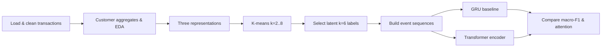

# Online Retail — Representation Learning & Sequence Modeling (Assignment 3)

**Author:** Peter Mangoro  
**Dataset:** Online Retail (UCI / Kaggle-style invoice line items) — [`data.csv`](data.csv)  
**Deliverables:** [`assignment3_pipeline.ipynb`](assignment3_pipeline.ipynb), [`assignment3.py`](assignment3.py), [`assignment3_report.md`](assignment3_report.md)

---

## Overview

This assignment applies **representation learning** and **sequence modeling** to **Online Retail** transaction data. The workflow is **customer-level**: first discover **hidden shopper segments** without hand-made labels (unsupervised clustering), then train **neural sequence models** (GRU and Transformer) to predict those segments from each customer’s **purchase history**.

The notebook and script move from **DGP framing → data cleaning → feature engineering → EDA → clustering (raw / sequence / latent) → sequence dataset construction → GRU vs Transformer → attention diagnostics → conclusions**.

| Artifact | Description |
|----------|-------------|
| [`assignment3_pipeline.ipynb`](assignment3_pipeline.ipynb) | Main analysis notebook (figures, code, hyperparameters) |
| [`assignment3.py`](assignment3.py) | Runnable export of the pipeline; supports `--html-report` |
| [`assignment3_report.md`](assignment3_report.md) | Standalone written report |
| [`assignment3_report.html`](assignment3_report.html) | HTML report (from script) |
| [`report.pdf`](report.pdf) | PDF export |
| [`data.csv`](data.csv) | Raw invoice line items |

---

## Problem statement

**Unit of analysis:** Each **customer** is one example.

**Unsupervised goal:** Find meaningful **customer segments** from aggregated and compressed behavioral features—without predefined marketing labels.

**Supervised goal:** Given a customer’s **time-ordered purchase sequence** (products + line-level numerics), predict the **segment label** from **latent-space K-means (k = 6)**. Intuitively: if shopping patterns reflect “customer type,” a sequence model should recover structure similar to what clustering found from summaries.

**Informal DGP:**

`future_behavior ≈ g(recency, frequency, spend_level, basket_diversity, temporal_patterns, context) + ε`

We describe **observed transactional behavior** under cleaning and coverage constraints—not universal consumer behavior. Many rows lack `CustomerID`; modeling uses **positive purchases** after removing returns/cancellations and invalid economics.

**Success criteria:** Stable, interpretable **clusters**; **macro-F1** on held-out customers (balanced across segments); comparison of **GRU** vs **Transformer** under identical splits and leakage-safe preprocessing.

---

## Data

| Stage | Scale | Notes |
|-------|--------|--------|
| Raw `data.csv` | **541,909** line items | 8 columns: invoice, product, qty, price, date, customer, country |
| After cleaning (identified customers) | **406,829** rows | Drop missing `CustomerID` |
| Purchase-only stream | **392,692** rows | Positive qty/price, non-cancellation |
| Customers for modeling | **4,338** | Disjoint train / val / test: **3,036 / 651 / 651** (~70/15/15) |

### Raw columns

`InvoiceNo`, `StockCode`, `Description`, `Quantity`, `InvoiceDate`, `UnitPrice`, `CustomerID`, `Country`

### Cleaning policies

- Drop rows with missing **`CustomerID`** (~24.9% of raw rows)
- Remove **exact duplicate** transactions (~5,268 rows)
- Tag **cancellations** (invoice prefix `C`) and non-positive quantities
- **`transactions_purchase`:** positive quantity, positive price, non-cancellation — used for behavior modeling

### Customer-level engineered features (examples)

| Feature | Role |
|---------|------|
| `n_invoices` | Purchase frequency |
| `total_spend`, `avg_invoice_value` | Monetary propensity |
| `recency_days` | Days since last purchase vs dataset end |
| `mean_interpurchase_days` | Cadence between orders |
| `item_diversity_ratio` | Unique products / total line items |

---

## Methodology



### 1. Three representations for clustering

| Family | Contents | Role |
|--------|----------|------|
| **`raw`** | Frequency, spend, recency, diversity aggregates | Stable summaries |
| **`sequence`** | Raw + invoice-level dynamics (basket spread, inter-order gaps) | Cadence and variability |
| **`latent`** | Standardized sequence features → **PCA (7 components, ~95% variance)** + light K-means metadata | Compact space for K-means |

**Selection:** K-means for **k = 2 … 8** on each family; **silhouette** primary, **Davies–Bouldin** tie-break; Calinski–Harabasz and inertia as backup.

### 2. Unsupervised findings

- **`raw` / `sequence`:** Best silhouette often at **k = 2** (~0.90–0.96) but **extremely skewed** cluster sizes → **“inliers vs outliers”**, not rich personas.
- **`latent`:** **k = 6** gives a more **multi-segment** partition (weaker global silhouette ~0.32–0.38, but more actionable taxonomy).
- **Sanity check:** **Ward agglomerative** on latent at k = 6 vs K-means: **ARI ≈ 0.943**, **NMI ≈ 0.884** — stable six-way structure.

**Supervised labels:** Latent **k = 6** classes (0–5), roughly **46% / 36% / 8% / 8% / 0.6% / 0.05%** — strongly imbalanced downstream.

### 3. Sequence representation (supervised models)

Per timestep: **categorical `StockCode` token** + standardized **`Quantity`**, **`UnitPrice`**, line amount.

- **Max length:** ~**95th percentile** of sequence length, **capped at 120** events
- **Padding + mask** for shorter histories
- **Vocabulary** built from **training customers only** (~3,600 tokens) — **no leakage**

### 4. Supervised models

| Model | Architecture | Training notes |
|-------|----------------|----------------|
| **GRU baseline** | Token embeddings + numeric projections + pooled hidden state | Cross-entropy; early validation plateau → overfitting |
| **GRU + class weights** | Same | Macro-F1 **0.25 → 0.29** (test); accuracy **0.69 → 0.57** |
| **Transformer encoder** | Multi-head self-attention, same inputs/readout | Best val macro-F1 ~**0.33**; loss overfits after early epochs |

**Checkpoint selection:** **Validation macro-F1** (not raw accuracy) under severe imbalance.

**Attention (diagnostic):** Head-averaged weights on **two test customers** — non-uniform focus over past events; descriptive only, not causal.

### 5. Sequence-length ablation

`max_len ∈ {40, 80, 120}`: **120** best (accuracy ~0.68, macro-F1 ~0.25); shorter truncation hurts; runtime gain minor → keep **p95-capped 120**.

---

## Challenges

1. **Missing customers** — ~25% of rows lack `CustomerID`; customer-level inference is conditional on identified shoppers.
2. **Heavy tails** — Quantity, price, and spend dominated by outliers; log transforms and robust aggregates needed in EDA.
3. **Returns and cancellations** — ~2.2% line rates; gross vs net sales differ by ~6.9%; country-specific return spikes (e.g. Japan ~10%).
4. **Cluster semantics** — High silhouette at k = 2 on raw/sequence masks **outlier separation**, not marketing segments; latent k = 6 chosen for downstream usefulness.
5. **Label imbalance** — Ultra-rare classes (supports in test in single digits) make per-class F1 **noisy**.
6. **Customer-level leakage** — All events for one customer must stay in one split; vocabulary and scalers from **train only**.
7. **Overfitting** — Both GRU and Transformer: training loss falls while validation loss rises after early epochs.
8. **Objective tradeoff** — Accuracy vs macro-F1 pull in opposite directions under class weights and architecture choice.

---

## What we achieved

### End-to-end retail analytics pipeline

- Auditable cleaning: **`df_raw` → `transactions_clean` → `transactions_purchase` → `customer_events` → `customer_features_base`**
- EDA on skew, seasonality (2010–2011 ramp; December partial month), country concentration, and returns impact

### Unsupervised structure discovery

- Compared **three representation families** across **k = 2 … 8**
- Justified **latent k = 6** for supervised labels with **hierarchical clustering agreement** (ARI/NMI)

### Leakage-safe sequence modeling

- **4,338** customers, disjoint splits, train-only vocabulary and numeric scaling
- **GRU** and **Transformer** on identical protocol

### Test-set comparison (selected metrics)

| Model | Test accuracy | Test macro-F1 | Train time | Parameters |
|-------|---------------|---------------|------------|------------|
| **Transformer** | 0.596 | **0.295** | ~9.65 s | 292,566 |
| **GRU** | **0.685** | 0.250 | ~6.65 s | 288,326 |
| GRU + class weights | 0.575 | **0.294** | — | — |

- **Transformer** wins on **macro-F1** (minority classes 0 and 3 get non-zero F1 vs GRU zeros); **GRU** wins on **accuracy** and **runtime**
- Similar parameter counts → differences driven by **how sequences are aggregated**, not model size
- **Attention visualizations** link predictions to specific **StockCodes** and timesteps

### Practical decision rule

| Priority | Prefer |
|----------|--------|
| Balanced segment recovery, macro-F1 | **Transformer** (or weighted GRU) |
| Top-line accuracy, lower runtime | **GRU** baseline |

---

## Repository layout

```
assignments/assignment3/
├── README.md                    # This file
├── data.csv                     # Raw transactions
├── assignment3_pipeline.ipynb   # Main notebook
├── assignment3.py               # Script export (+ --html-report)
├── assignment3_report.md          # Written report
├── assignment3_report.html        # Generated HTML report
└── report.pdf                   # PDF export
```

---

## How to reproduce

1. Create a virtual environment and install dependencies:

   ```bash
   python -m venv .venv
   source .venv/bin/activate
   pip install numpy pandas matplotlib seaborn scikit-learn torch ipython markdown
   ```

   Core packages are listed in [`../requirements.txt`](../requirements.txt); this assignment also needs **PyTorch**.

2. Ensure `data.csv` is in `assignments/assignment3/`.

3. **Notebook:** Open `assignment3_pipeline.ipynb`, set working directory to `assignments/assignment3/`, restart kernel, run all cells.

4. **Script (optional):**

   ```bash
   cd assignments/assignment3
   python assignment3.py
   ```

   Generate HTML report (requires notebook present for narrative weave):

   ```bash
   python assignment3.py --html-report
   ```

5. **Slow sections:** Clustering grids, sequence tensor build, GRU/Transformer training, attention plots.

---

## Key takeaway

Online Retail customers can be segmented in **latent PCA space (k = 6)** with stable cluster structure, then **partially recovered from purchase sequences** by neural models. Under **severe class imbalance**, **macro-F1**—not accuracy—is the right headline metric: the **Transformer** trades overall accuracy for **better minority-segment signal**, while the **GRU** is faster and more accurate on majority classes. **Leakage-safe customer splits**, **honest zero/return handling**, and **sequence length 120** are as important as architecture choice; future gains likely come from **rebalancing or merging tail segments**, not simply adding model complexity.

For full figures, clustering tables, training curves, and attention examples, see **`assignment3_pipeline.ipynb`** or **`assignment3_report.md`**.
