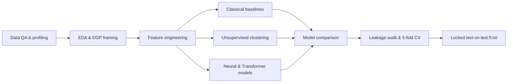

# Amazon Review Sentiment Analysis — Course Final Project

**Team:** 4  
**Course deadline:** May 18, 2026  
**Dataset:** [Amazon Reviews (Kaggle)](https://www.kaggle.com/datasets/bittlingmayer/amazonreviews)

---

## Overview

This project is the **course final (Option 4: Amazon Reviews)** for a data science program. We build and compare end-to-end pipelines that predict **binary sentiment** from English Amazon product review text: **negative (`0`)** vs **positive (`1`)**.

The work is documented in a single reproducible technical report:

| Artifact | Description |
|----------|-------------|
| [`final_notebook.ipynb`](final_notebook.ipynb) | Full analysis: EDA, baselines, unsupervised discovery, neural/Transformer models, leakage audit, locked test |
| [`final_notebook.pdf`](final_notebook.pdf) | Exported report |
| [`Amazon_Sentiment_ArchitectureFinal.pdf`](Amazon_Sentiment_ArchitectureFinal.pdf) | System / pipeline architecture overview |
| [`Amazon_Sentiment_ArchitectureFinal.pptx`](Amazon_Sentiment_ArchitectureFinal.pptx) | Architecture slides |

We treat the task as **associative prediction** on observed reviews—not causal inference about product quality. Labels reflect **expressed sentiment in text**, subject to reviewer bias and selection (only some customers leave reviews).

---

## Problem statement

**Input:** Raw review text (fastText format: `__label__1` / `__label__2` prefix + text).  
**Output:** Predicted polarity (mapped to `0` = negative, `1` = positive).

**Success criteria:** Strong out-of-sample **F1** and **ROC-AUC**, with a rigorous protocol that avoids test-set leakage and supports a defensible deployment choice.

---

## Data

| File | Rows | Role |
|------|------|------|
| `data/train.ft.txt` | 3,600,000 | Development, fitting, internal validation, cross-validation |
| `data/test.ft.txt` | 400,000 | **Held out** until Section 7.3 — one locked evaluation only |

**Download:** [Kaggle — Amazon Reviews](https://www.kaggle.com/datasets/bittlingmayer/amazonreviews). Extract `train.ft.txt` and `test.ft.txt` into `final/data/`.

**Quality checks:** Malformed rows and empty text are profiled; labels are nearly balanced (~50% / 50%) on sampled profiles. Review length is **right-skewed** (median ~382 characters / ~70 words; 95th percentile ~894 characters / ~161 words), which motivates truncation choices for neural models.

---

## Methodology

The notebook follows a fixed pipeline from raw data to deployment recommendation:



### 1. Exploratory analysis and framing

- Data-generating process (DGP) narrative: latent factors (expectations, shipping, category norms) → language → observed label.
- Label balance, length distributions, and top unigrams by class (e.g. polarity-aligned terms vs words like “good” that appear in mixed/negated contexts).
- Feature-engineering decisions recorded with **leakage awareness** (train-only fitting for all transforms).

### 2. Representations

| Representation | Settings | Use |
|----------------|----------|-----|
| TF–IDF bag-of-words | 1–2 grams, `max_features=300k`, `min_df=5`, `sublinear_tf` | Linear models, MLP, ablations |
| Truncated SVD (200 dims) | On TF–IDF, train sample | K-means on lexical factors |
| Sentence embeddings | `all-MiniLM-L6-v2`, 384-d, L2-normalized | Semantic K-means |
| Subword tokens | DistilBERT, `max_length=96` | Contextual classifier |

### 3. Supervised models

**Classical (Section 4)** — up to **500k** training-file rows (400k train / 100k validation):

- TF–IDF + **Logistic Regression**
- TF–IDF + **Linear SVM** (SGD, hinge loss) — **selected leader**
- TF–IDF + **Random Forest** (nonlinear comparator on same sparse features)
- **Length ablation:** optional `log1p(word_len)` appended to TF–IDF on a 120k subset

**Neural (Section 6)** — **120k** subset (96k train / 24k validation) for compute:

- **MLP** on train-only vocabulary (bag-of-words tokens)
- **DistilBERT** (`distilbert-base-uncased`) fine-tuned classification head
- Attention visualization and **truncation ablation** (64 / 96 / 128 tokens)

**Model selection policy:** Primary metric = **F1**; tie-break = **ROC-AUC**. Supporting metrics: accuracy, precision, recall, PR-AUC.

### 4. Unsupervised structure (Section 5)

- **K-means** on TF–IDF → SVD vectors (`k = 4…8`); best silhouette at **k = 6** (weak but interpretable topical structure).
- **K-means** on sentence embeddings; best silhouette at **k = 5**.
- Cluster profiles: size, label mix, length stats, and sample reviews — used for **interpretation only**, not as supervised features.

### 5. Evaluation integrity (Section 7)

- **Leakage audit:** `test.ft.txt` not loaded until Section 7.3; sklearn `Pipeline` fits TF–IDF on train folds only; NN vocab and max length from train split only.
- **5-fold stratified CV** on the 500k training-file cap.
- **Locked evaluation:** Refit TF–IDF + SGD on 500k train-file rows; evaluate **once** on full 400k-row test file.

---

## Challenges

1. **Scale** — Millions of training rows; full-corpus training is expensive. We use capped subsets (500k classical, 120k neural) while keeping protocols explicit.
2. **Long reviews** — A non-trivial tail exceeds typical Transformer windows; aggressive truncation can hurt a small fraction of reviews (addressed via EDA and a truncation sweep).
3. **Lexical ambiguity** — Unigrams miss negation and context (“not good”, mixed sentiment). Motivates DistilBERT, but at matched data scale classical BoW still wins on F1.
4. **Leakage risk** — Vocabulary, SVD, clustering, and model choice must never peek at `test.ft.txt` or validation labels during fitting. The notebook enforces a strict run order.
5. **Compute vs payoff** — Random Forest and Transformers add cost without beating a **linear margin on TF–IDF** at our development scales; much of the gap to the 500k leader is **data scale**, not architecture alone.
6. **Weak unsupervised separation** — Low silhouette on compressed text and embeddings; clusters are exploratory, not crisp market segments.

---

## What we achieved

### Strong, stable sentiment classification

| Evaluation | F1 | ROC-AUC | Notes |
|--------------|-----|---------|--------|
| Validation (500k cap, TF–IDF + SGD) | ~0.907 | ~0.966 | 400k train / 100k val |
| 5-fold CV (500k cap) | **0.9071 ± 0.0011** | **0.9660 ± 0.0006** | Stable across folds |
| **Locked test** (`test.ft.txt`, 400k rows) | **0.9056** | **0.9660** | Accuracy ~0.905; one-time held-out eval |

Locked-test metrics align with development and CV within ~0.001 F1, supporting a trustworthy deployment estimate.

### Rigorous comparison across model families

| Model | Approx. dev F1 | Role |
|-------|----------------|------|
| TF–IDF + SGD (500k cap) | ~0.907 | **Recommended deployment** |
| TF–IDF + Logistic Regression | ~0.907 | Equivalent to SGD on this featurization |
| TF–IDF + Random Forest | ~0.83–0.84 | Nonlinear classical baseline |
| TF–IDF + SGD (120k matched) | ~0.898 | Fair comparison to neural runs |
| MLP (120k) | ~0.888 | Neural BoW baseline |
| DistilBERT (120k, partial fine-tune) | ~0.874 | Higher precision, lower recall |

### Other outcomes

- Documented **data quality** and **DGP assumptions** for graders and reproducibility.
- **Unsupervised** topical/semantic groupings with qualitative cluster profiles.
- **DistilBERT attention** plots for interpretability (negation-heavy and error cases).
- **Ablation evidence:** `log1p(word_len)` gives only a small F1 lift; truncation near 96 tokens is reasonable for this corpus.
- Clear **deployment recommendation:** **TF–IDF + SGD (hinge)** for cost, speed, interpretability, and best F1 at scale.

### Limitations and future work

- Neural/Transformer training capped at 120k rows vs 500k for linear models.
- Locked refit uses 500k train-file rows, not the full 3.6M corpus.
- No product- or time-based held-out splits; generalization under distribution shift is untested.
- Full-corpus refit and matched-scale Transformer training are natural next steps.

---

## Repository layout (`final/`)

```
final/
├── README.md                          # This file
├── final_notebook.ipynb               # Main deliverable
├── final_notebook.pdf                 # Exported report
├── Amazon_Sentiment_ArchitectureFinal.pdf
├── Amazon_Sentiment_ArchitectureFinal.pptx
├── data/                              # Not in git — download from Kaggle
│   ├── train.ft.txt
│   └── test.ft.txt
└── .venv/                             # Optional local virtualenv (gitignored)
```

---

## How to reproduce

1. **Clone** the repository and `cd` into `final/`.

2. **Create a virtual environment** and install dependencies (minimum set used in the notebook):

   ```bash
   python -m venv .venv
   source .venv/bin/activate
   pip install pandas numpy matplotlib seaborn scikit-learn torch transformers sentence-transformers tqdm
   ```

3. **Download data** from Kaggle into `final/data/` as `train.ft.txt` and `test.ft.txt`.

4. **Open and run** `final_notebook.ipynb`:
   - **Restart kernel** and run all cells top-to-bottom.
   - **Do not** load or tune on `test.ft.txt` until **Section 7.3**.
   - Slow sections: Section 4 baselines (~500k rows), Random Forest, DistilBERT training, Section 7.2 CV, Section 7.3 locked predict.

5. **Optional:** For Hugging Face model download (DistilBERT), set `HF_TOKEN` in a local `.env` file — **never commit tokens** to version control.

To scale up classical training, increase `BASELINE_TRAIN_MAX_ROWS` in the notebook (or set to `None` for a full `train.ft.txt` pass) after pipelines are verified.

---

## Key takeaway

Under a **leakage-safe** protocol on a large Amazon review corpus, a well-tuned **TF–IDF + linear SVM (SGD)** pipeline delivers **~90.6% F1** and **~96.6% ROC-AUC** on a held-out test set of 400k reviews—matching cross-validation and internal validation. More complex models (Random Forest, MLP, DistilBERT) were implemented and compared for course coverage and interpretability, but **sparse lexical features with a linear margin** remain the practical choice for this task at our training scale.

For full figures, tables, code, and section-by-section discussion, see **`final_notebook.ipynb`** or **`final_notebook.pdf`**.
